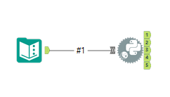

# Azure Table Connector for Alteryx

A Python-based utility to read up to five Azure Table Storage tables with your Alteryx Python tool.

## ⚠️ Security Warning
**Do not hardcode your AccountKey.** 
- It is highly recommended to use Alteryx Text Input or encrypted parameters for credentials.

## Requirements
- `azure-data-tables` (Python library)

## Usage
The script `azure_table_script_gallery.py` is designed to work universally:
- **Local Designer**: Auto-installs to your user profile if needed (no Admin rights required).
- **Alteryx Server**: Auto-installs on the worker node if the library is missing.

Simply copy the code from `azure_table_script_gallery.py` into your Alteryx Python tool.

## Configuration

### 1. Workflow Setup
Connect a **Text Input** tool to the Python tool (Anchor #1). Each row in your input is automatically mapped to a numbered output anchor.

  

#### Input #1 Column Structure
| Anchor | StorageAccount | AccountKey | TableName | EndpointSuffix |
| :--- | :--- | :--- | :--- | :--- |
| **Output 1** | `account_a` | `key_a` | `Table_01` | `core.windows.net` |
| **Output 2** | `account_a` | `key_a` | `Table_02` | `core.windows.net` |
| **Output 3** | `account_b` | `key_b` | `Table_03` | `core.windows.net` |
| **Output 4** | `account_b` | `key_b` | `Table_04` | `core.windows.net` |
| **Output 5** | `account_c` | `key_c` | `Table_05` | `core.windows.net` |

> [!TIP]
> `EndpointSuffix` is optional. If left blank, it defaults to `core.windows.net`.

### 2. Implementation
1. Paste the code from the chosen `.py` file into the Alteryx Python tool.
2. Ensure your Text Input is connected to anchor **#1**.
3. Run the workflow.

---

Feel free to fork this project or leave a star if it helped your workflow.

